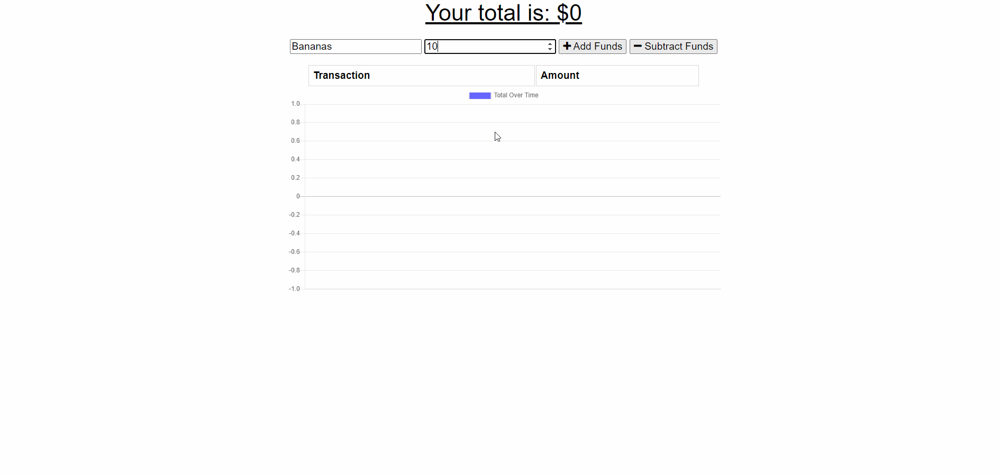

# 10-2-hw-on-off-budget-tracker

## Description

Progressive Web Application which uses a service worker and web manifest to provide offline functionality to a budget tracker. Application uses indexedDB to store information if connection with server cannot be established.

## Deployment

[Deployment](https://hw-10-2-offline-budget.herokuapp.com/) on Heroku.

## Demonstration

## Notes

Majority of indexedDB code was taken from a class activity.
